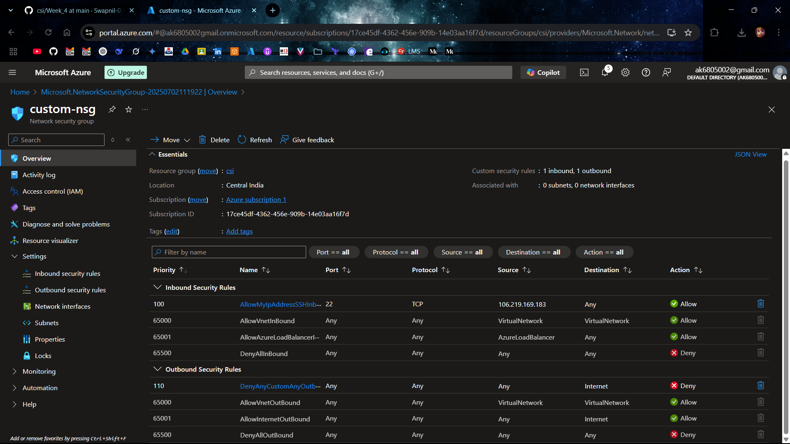
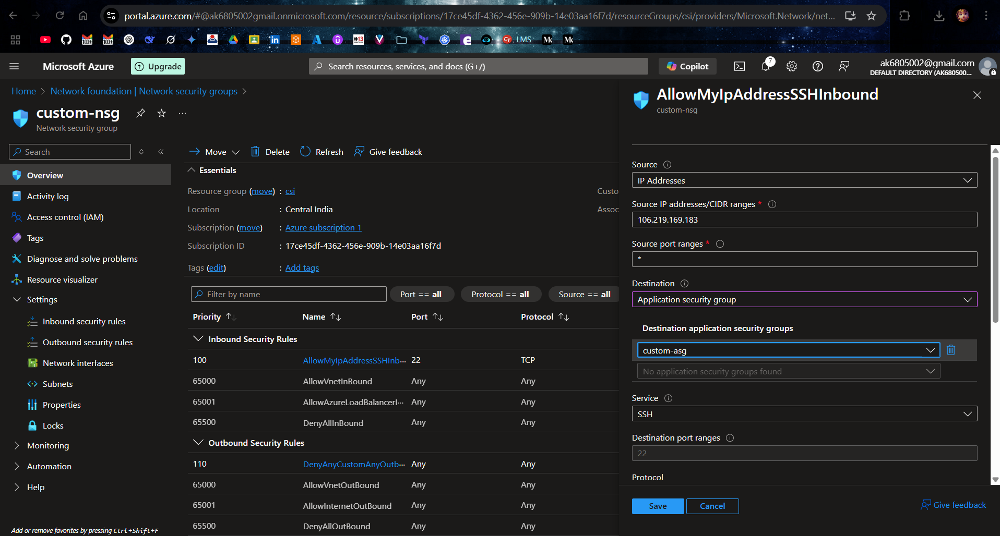
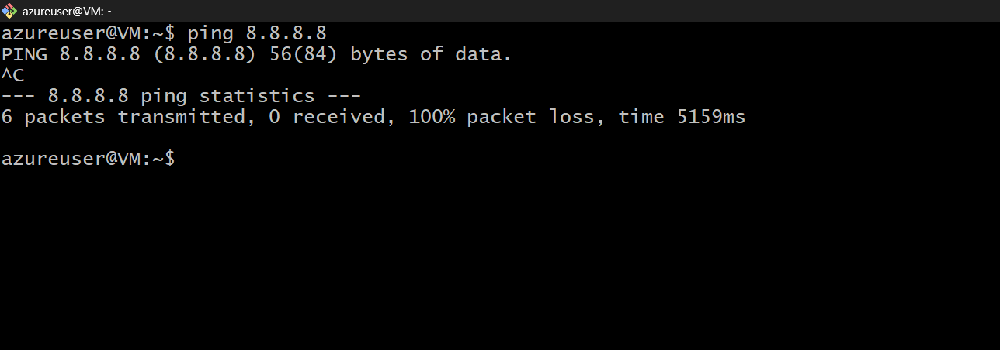
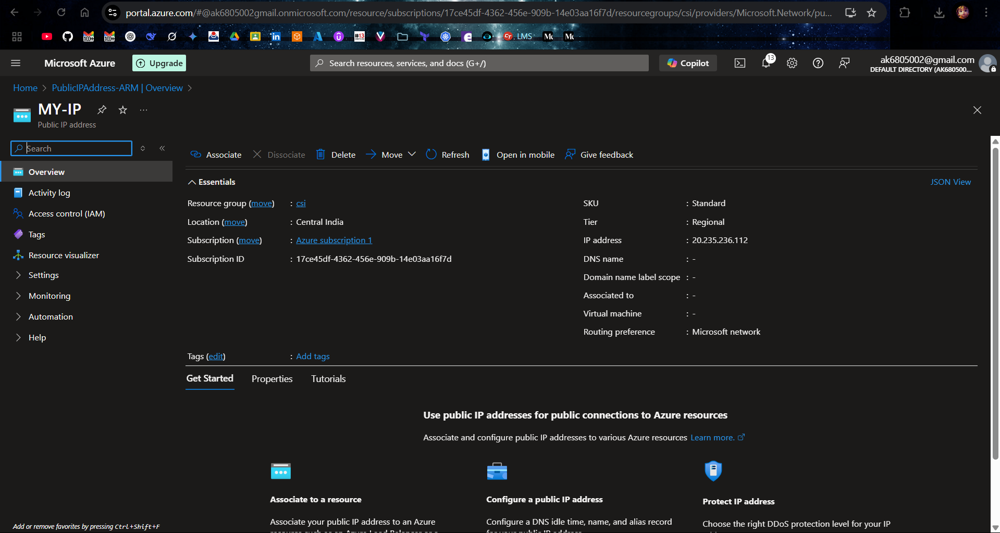
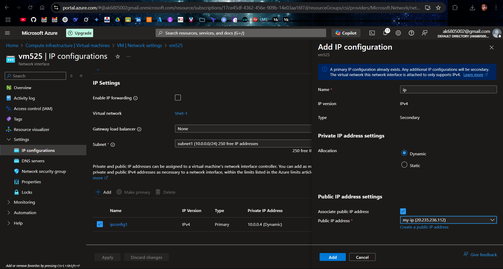
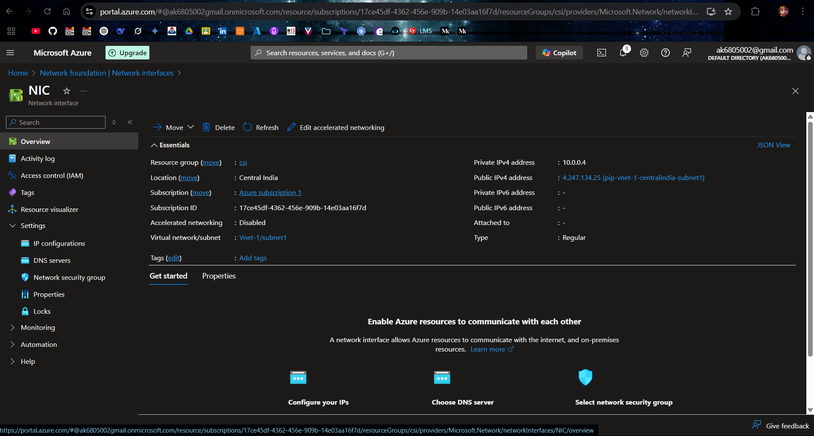
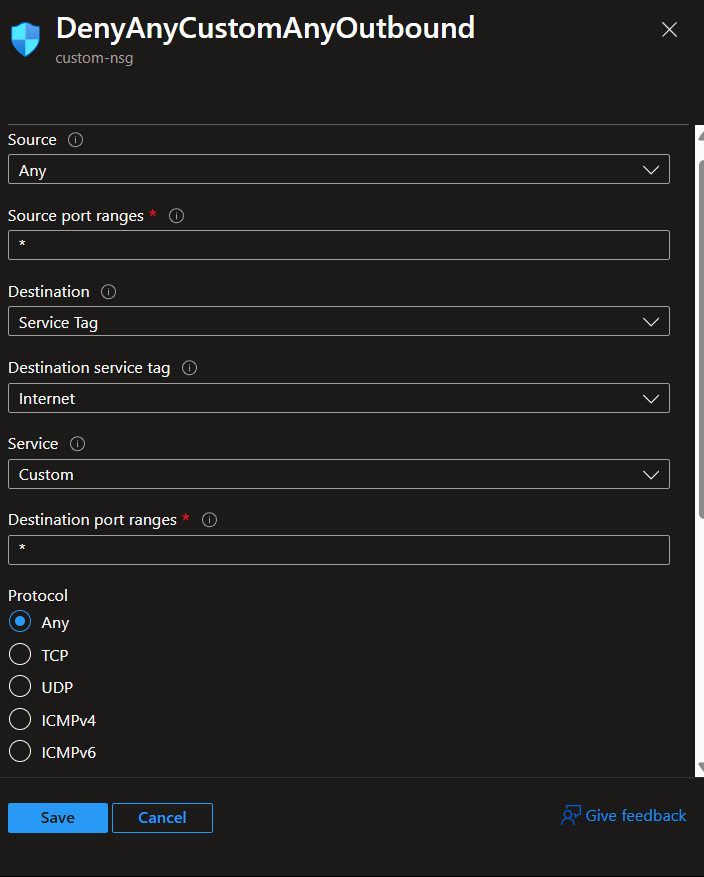

# Azure Network Security Group (NSG) and Application Security Group (ASG)

This document outlines the implementation steps for configuring Network Security Groups (NSGs) and Application Security Groups (ASGs) in Azure to control access to Virtual Machines (VMs), including allowing specific IPs, denying internet access, managing public IPs, and configuring static/dynamic IPs. It also covers creating NSGs, public IPs, associating/de-associating public IPs with VMs, and creating Network Interfaces.

---

## 1. Overview of NSG and ASG

- **Network Security Group (NSG)**: A firewall to control inbound and outbound traffic to Azure resources using rules based on IP, port, and protocol.
- **Application Security Group (ASG)**: A logical grouping of VMs to simplify NSG rules by applying policies to the group instead of individual VMs.

---

## 2. Implementation Steps

### 2.1 Creating a Network Security Group (NSG)

1. **Access Azure Portal**:
   - Log in to the Azure Portal.
2. **Navigate to NSGs**:
   - Go to **Create a resource** > **Networking** > **Network Security Group**.
3. **Configure NSG**:
   - **Name**: Enter a unique name (e.g., `custom-nsg`).
   - **Subscription**: Select your subscription.
   - **Resource Group**: Choose or create a resource group.
   - **Location**: Select the Azure region.
   - Click **Review + Create** > **Create**.
4. **Add Inbound Rules**:
   - Go to the NSG > **Inbound security rules** > **Add**.
   - Example rule to allow specific IPs:
     - **Source**: My IP Addresse
     - **Source IP Addresses/CIDR**: `Your IP`
     - **Protocol**: TCP
     - **Destination Port**: 22
     - **Action**: Allow
     - **Priority**: 100
     - **Name**: `Allow-SSH-Specific-IP`
5. **Deny Internet Access**:
   - Add an outbound rule:
     - **Source**: Any
     - **Destination**: Internet
     - **Protocol**: Any
     - **Action**: Deny
     - **Priority**: 200
     - **Name**: `Deny-Internet-Outbound`

### 2.2 Creating an Application Security Group (ASG)

1. **Navigate to ASGs**:
   - Go to **Create a resource** > **Networking** > **Application Security Group**.
2. **Configure ASG**:
   - **Name**: Enter a name (e.g., `custom-ASG`).
   - **Resource Group**: Select the resource group.
   - **Location**: Select the region.
   - Click **Review + Create** > **Create**.
3. **Associate VMs with ASG**:
   - Go to the VM > **Networking** > **Application security groups**.
   - Select the ASG (e.g., `WebServerASG`) and save.

4. **Use ASG in NSG Rules**:
   - In the NSG, create a rule using the ASG as the source or destination.
   - Example: Allow HTTP traffic to `WebServerASG`:
     - **Source**: Any
     - **Destination**: Application Security Group (`custom-ASG`)
     - **Protocol**: TCP
     - **Destination Port**: 22
     - **Action**: Allow
     - **Priority**: 110
     - **Name**: `Allow-ssh-ASG`

### 2.3 Denying Internet with NSG

1. **Deny Internet Access**:
   - Add an outbound rule to block internet:
     - **Source**: Any
     - **Destination**: Service Tag (`Internet`)
     - **Protocol**: Any
     - **Action**: Deny
     - **Priority**: 200
     - **Name**: `Deny-Internet`

### 2.4 Public IPs and Types (Static and Dynamic)

- **Public IP Address**: An IP address accessible over the internet.
- **Types**:
  - **Static**: Fixed IP address that does not change.
  - **Dynamic**: IP address assigned from a pool, may change on VM restart or deallocation.
- **Use Case**: Static IPs for consistent access (e.g., web servers); dynamic IPs for cost-saving or temporary use.

#### Creating a Public IP

1. **Navigate to Public IPs**:
   - Go to **Create a resource** > **Networking** > **Public IP Address**.
2. **Configure Public IP**:
   - **Name**: Enter a name (e.g., `My-IP`).
   - **SKU**: Standard
   - **IP Version**: IPv4 or IPv6
   - **IP Assignment**:
     - **Static**: Choose for fixed IP.
     - **Dynamic**: Choose for cost-effective, changeable IP.
   - **Resource Group**: Select the resource group.
   - **Location**: Select the region.
   - Click **Review + Create** > **Create**.

#### Associating a Public IP with a VM

1. **Go to VM**:
   - Navigate to the VM in the Azure Portal.
2. **Networking**:
   - Go to **Networking** > **Network Interface** > **IP Configurations**.
   - Select the IP configuration.
3. **Associate Public IP**:
   - Click **Associate** > Select the public IP (e.g., `MY-IP`).
  

#### De-associating a Public IP

1. **Go to Network Interface**:
   - Navigate to the VM’s network interface > **IP Configurations**.
2. **Remove Public IP**:
   - Select the IP configuration.
   - Click **Dissociate** > Save.
   - Save changes.

### 2.6 Creating a Network Interface (NIC)

1. **Navigate to NICs**:
   - Go to **Create a resource** > **Networking** > **Network Interface**.
2. **Configure NIC**:
   - **Name**: Enter a name (e.g., `NIC`).
   - **Virtual Network**: Select the VNet.
   - **Subnet**: Choose a subnet.
   - **Private IP**:
     - **Dynamic**: Automatically assigned.
     - **Static**: Specify an IP (e.g., `10.0.0.10`).
   - **Public IP**: Associate a public IP or select **None**.
   - **Resource Group**: Select the resource group.
   - **Location**: Select the region.
   - Click **Review + Create** > **Create**.
3. **Attach NIC to VM**:
   - Go to the VM > **Networking** > **Attach network interface**.
   - Select the NIC (e.g., `MyNIC`) > Save.

### 2.7 Using Service Tags

- **Service Tags**: Predefined identifiers for Azure services or IP ranges (e.g., `Internet`).
- **Implementation**:
  - In NSG rules, use service tags instead of specific IPs for broader access control.
  - Example: Deny outbound to `Internet`
    - **Source**: Any
    - **Destination**: Service Tag (`Internet`)
    - **Protocol**: Any
    - **Action**: Deny
    - **Priority**: 100
    - **Name**: `Deny-Internet`

