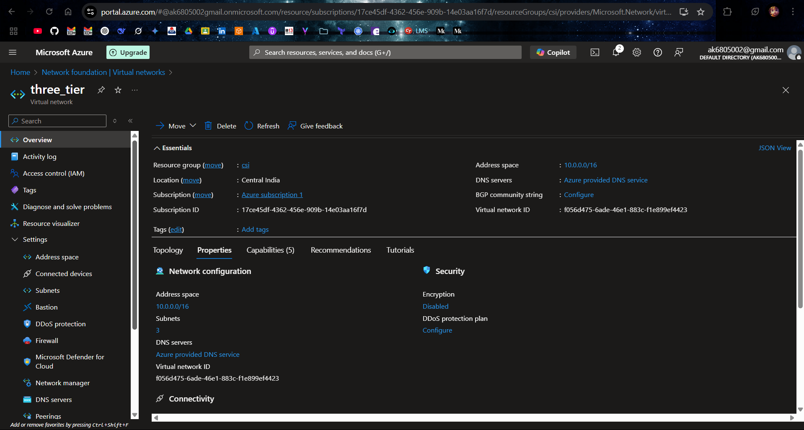
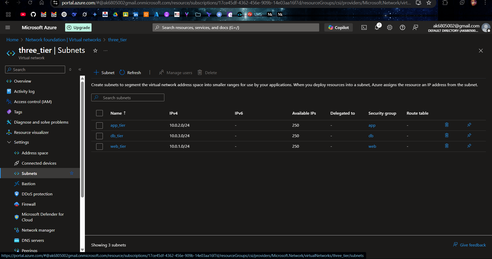
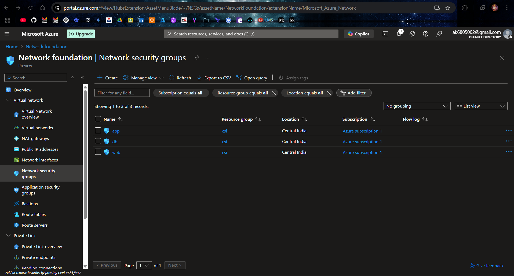
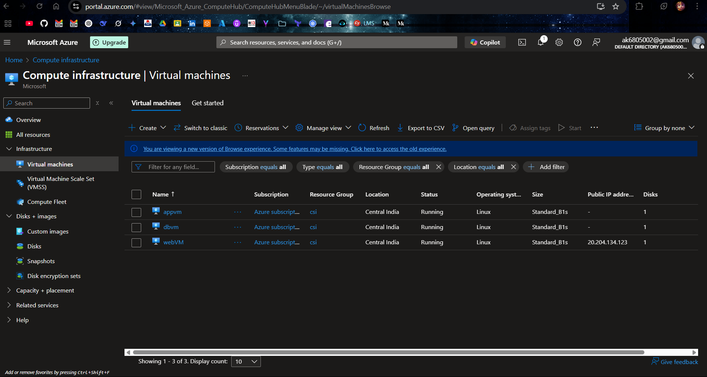
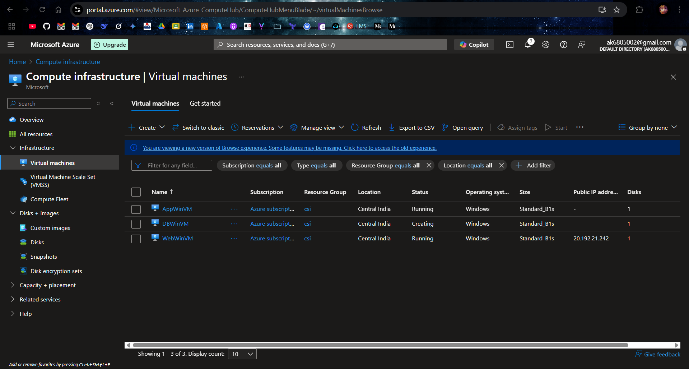
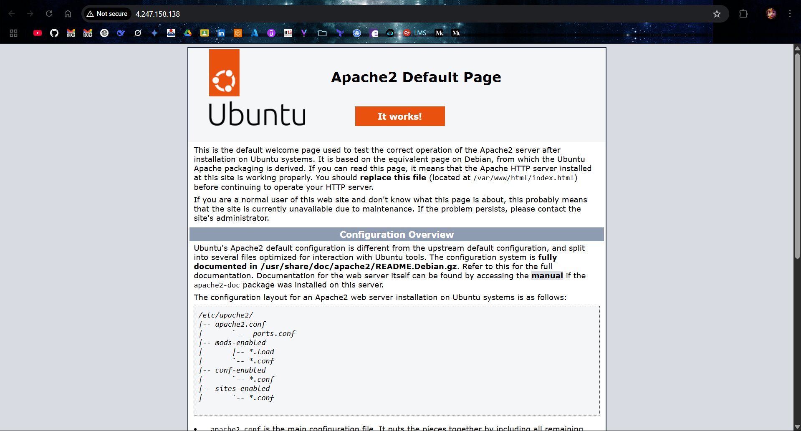
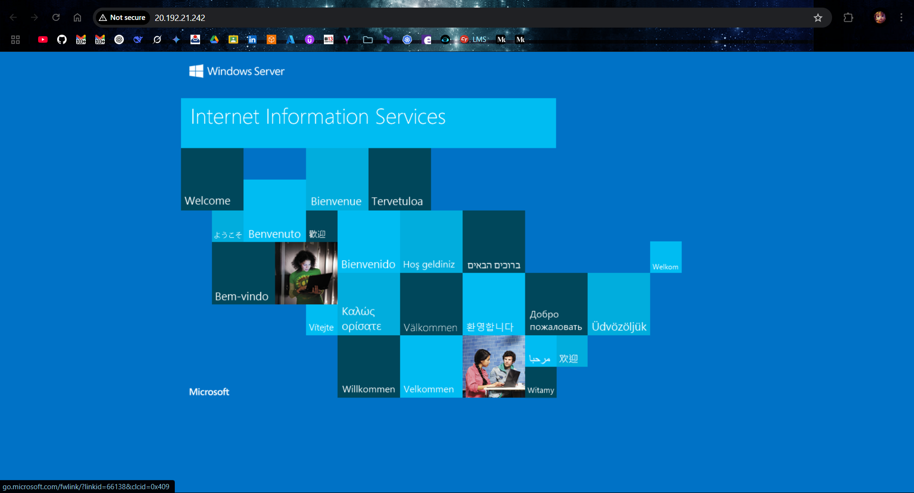

# Azure Multi-Tier Architecture Deployment

This README provides detailed steps to
create three subnets : 1. Web tier 2. App tier 3. DB tier DB Tier should not access any tier(Web & App tier) App tier should access the DB tier and Web tier as well, Web tier should acccess only App tier. Only Web tier is allowed to connect to the internet.Deploy two VM's in each tier(One VM should be Linux & another should be Windows). Configure Apache Server on Linux VM's And IIS Server on Windows.

## Architecture Overview

- **Virtual Network (VNET)**:
  - Name: `three_tier`
  - Address Space: `10.0.0.0/16`
  - Subnets:
    - Web Tier: `10.0.1.0/24`
    - App Tier: `10.0.2.0/24`
    - DB Tier: `10.0.3.0/24`
- **Access Rules** (enforced via NSGs):
  - **Web Tier**: Allows inbound HTTP/HTTPS (ports 80/443) from the internet, outbound to App Tier and internet.
  - **App Tier**: Allows inbound from Web Tier, outbound to Web Tier and DB Tier, no direct internet access.
  - **DB Tier**: Allows inbound from App Tier only, no outbound traffic.
- **VMs per Tier**:
  - 1 Linux VM with Apache.
  - 1 Windows VM with IIS.
## Implementation Steps

### Step 1: Create a Resource Group

1. Log in to the [Azure Portal](https://portal.azure.com).
2. Click **Create a resource** > Search for **Resource group** > Click **Create**.
3. Configure:
   - **Subscription**: Select your subscription.
   - **Resource group**: Enter `csi`.
   - **Region**: `Central India`.
4. Click **Review + create** > **Create**.

### Step 2: Create the Virtual Network (VNET) and Subnets

1. In the Azure Portal, click **Create a resource** > Search for **Virtual network** > Click **Create**.
2. Configure:
   - **Subscription**: Select your subscription.
   - **Resource group**: Select `csi`.
   - **Name**: Enter `three_tier`.
   - **Region**: `Central India`.
3. Click **Next: IP Addresses**.
4. Configure IP Addresses:
   - **IPv4 address space**: Enter `10.0.0.0/16`.
   - Add three subnets:
     - **WebTier**: Address range `10.0.1.0/24`.
     - **AppTier**: Address range `10.0.2.0/24`.
     - **DBTier**: Address range `10.0.3.0/24`.
5. Click **Review + create** > **Create**.


### Step 3: Create Network Security Groups (NSGs)

1. Click **Create a resource** > Search for **Network security group** > Click **Create**.
2. Create three NSGs: `Web`, `App`, `DB`.
3. For each NSG:
   - **Subscription**: Select your subscription.
   - **Resource group**: Select `csi`.
   - **Name**: Enter `Web`, `App`, or `DB`.
   - **Region**:`Central India`.
   - Click **Review + create** > **Create**.


4. Configure NSG Rules:
   - Go to **All resources** > Select each NSG > Click **Inbound security rules** or **Outbound security rules** > **Add**

   **WebTier NSG**:
   - **Inbound Rules**:
     - Name: `AllowHTTP`, Protocol: TCP, Source: Any, Destination: Any, Destination Port: 80, Action: Allow, Priority: 100.
     - Name: `AllowSSH`, Protocol: TCP, Source: Any, Destination: Any, Destination Port: 22, Action: Allow, Priority: 120.
     - Name: `AllowRDP`, Protocol: TCP, Source: Any, Destination: Any, Destination Port: 3389, Action: Allow, Priority: 130.
     - Name: `AllowAppTier`, Protocol: TCP, Source: `10.0.2.0/24`, Destination: Any, Destination Port: Any, Action: Allow, Priority: 140.

   **AppTier NSG**:
   - **Inbound Rules**:
     - Name: `AllowWebTier`, Protocol: TCP, Source: `10.0.1.0/24`, Destination: Any, Destination Port: Any, Action: Allow, Priority: 100.
   - **Outbound Rules**:
     - Name: `DenyInternet`, Protocol: Any, Source: Any, Destination: `Service Tag(Internet)`, Destination Port: Any, Action: Deny, Priority: 110.

   **DBTier NSG**:
   - **Inbound Rules**:
     - Name: `AllowAppTier`, Protocol: TCP, Source: `10.0.2.0/24`, Destination: Any, Destination Port: Any, Action: Allow, Priority: 100.
     - Name: `AllowWebTier`, Protocol: TCP, Source: `10.0.1.0/24`, Destination: Any, Destination Port: Any, Action: Allow, Priority: 100.
   - **Outbound Rules**:
     - Name: `DenyAllOutbound`, Protocol: Any, Source: Any, Destination: Any, Destination Port: Any, Action: Deny, Priority: 100.

5. Associate NSGs with Subnets:
   - Go to **Virtual networks** > Select `myVNet` > Click **Subnets**.
   - For each subnet:
     - Select `WebTier` > Set **Network security group** to `Web` > Save.
     - Select `AppTier` > Set **Network security group** to `App` > Save.
     - Select `DBTier` > Set **Network security group** to `DB` > Save.

### Step 4: Deploy VMs in Each Tier

1. **Create VMs**:
   - In the Azure Portal, click **Create a resource** > Search for **Virtual machine** > Click **Create**.
   - Deploy six VMs (two per tier: one Linux, one Windows) with the following configurations:

2. **Web Tier VMs**:
   - **Web-Linux-VM**:
     - **Subscription**: Select your subscription.
     - **Resource group**: Select `csi`.
     - **Virtual machine name**: `WebVM`.
     - **Region**: `Central India`.
     - **Image**: `Linux (ubuntu 24.04)`.
     - **Size**: `Standard B1s (1 vcpu, 1 GiB memory)`.
     - **Authentication type**: SSH keys
     - **Public inbound ports**: Select `Allow selected ports` > Select `SSH (22)`.
     - **Networking**:
       - **Virtual network**: Select `three_tier`.
       - **Subnet**: Select `WebTier (10.0.1.0/24)`.
       - **Public IP**: Create new (default name, e.g., `Web-Linux-VM-ip`).
     - Click **Review + create** > **Create**.

   - **Web-Windows-VM**:
     - **Subscription**: Select your subscription.
     - **Resource group**: Select `csi`.
     - **Virtual machine name**: `WebWinVM`.
     - **Region**: `Central India`.
     - **Image**: `Windows (Windows Server 2022 Datacenter Azure Edition)`.
     - **Size**: `Standard B1s (1 vcpu, 1 GiB memory)`.
     - **Authentication type**: SSH keys
     - **Public inbound ports**: Select `Allow selected ports` > Select `SSH (22)`.
     - **Networking**:
       - **Virtual network**: Select `three_tier`.
       - **Subnet**: Select `WebTier (10.0.1.0/24)`.
       - **Public IP**: Create new (default name, e.g., `Web-Linux-VM-ip`).
     - Click **Review + create** > **Create**.


### Step 5: Configure Apache on Linux VMs

1. **Connect to Linux VMs**:
   - **Web-Linux-VM**: 
     - Go to **Virtual machines** > Select `Web-Linux-VM` > Copy the **Public IP address**.
     - Use an SSH client (e.g., `ssh -i <private key> azureuser@<public-ip>` from a terminal)

2. **Install and Configure Apache**:
   - On Linux VM run:
     ```bash
     sudo apt update
     sudo apt install -y apache2
     sudo systemctl start apache2
     sudo systemctl enable apache2
     ```
3. **Test Web-Linux-VM**:
   - Open a browser and navigate to http://4.247.158.138


### Step 6: Configure IIS on Windows VMs

1. **Connect to Windows VMs**:
   - **Web-Windows-VM**:
     - Go to **Virtual machines** > Select `WebWinVM` > Copy the **Public IP address**.
     - Use an RDP client (e.g., Microsoft Remote Desktop) to connect to `<public-ip>` with username `azureuser` and your password.

2. **Install and Configure IIS**:
   - On Windows VM open PowerShell as Administrator and run:
     ```powershell
     Install-WindowsFeature -Name Web-Server -IncludeManagementTools
     ```
3. **Test Web-Windows-VM**:
   - From an external browser, navigate to http://20.192.21.242 


**Note: I created image snapshot of pre configured apache web sever and IIS server from `WebTier` subnet VMs to launch VMs in `AppTier` & `DBTier` subnets since they are not allowed to access internet.**