# ☁️ Azure Load Balancer Setup: Internal & External

This guide walks through creating and verifying both an **Internal Load Balancer (ILB)** and an **External Load Balancer (ELB)** in Azure using Linux VMs running **Apache2**.


## 🌐 Part 1: External Load Balancer (ELB)

### 1️⃣ Create Public Load Balancer

1. Go to **Azure Portal** → Search: `Load Balancer` → Click **Create**
2. **Basics**:
   - Name: `external-lb`
   - Type: **Public**
   - SKU: Standard
   - Tier: Regional
   - Region: same as your VMs

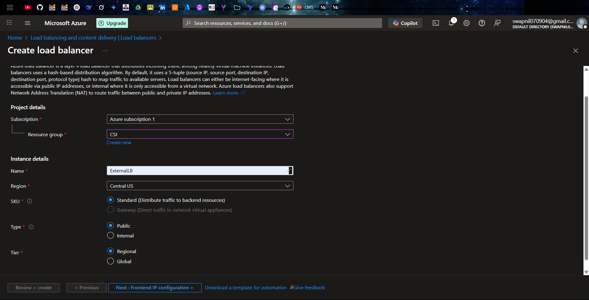

3. **Frontend IP**:
   - Create new public IP

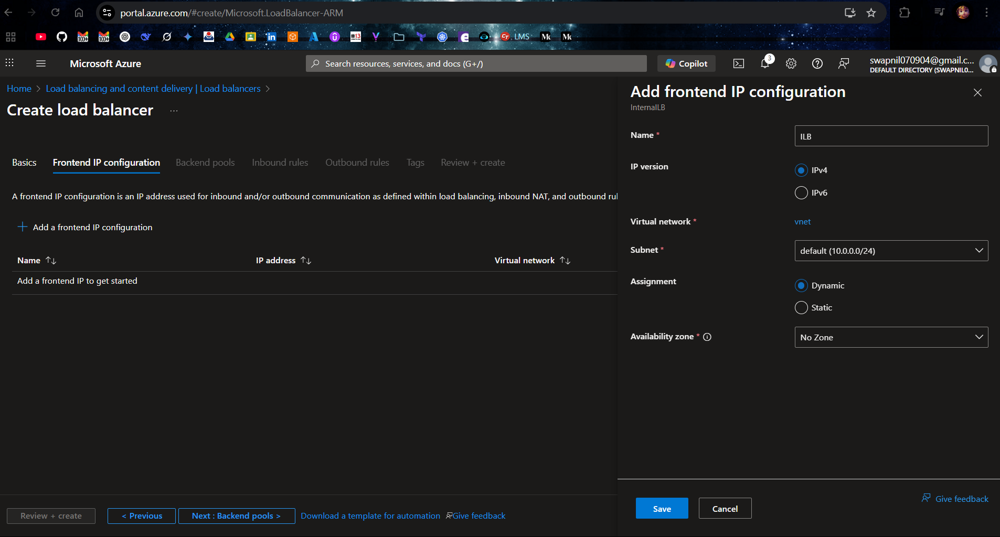

4. **Backend Pool**:
   - Add both VM NICs

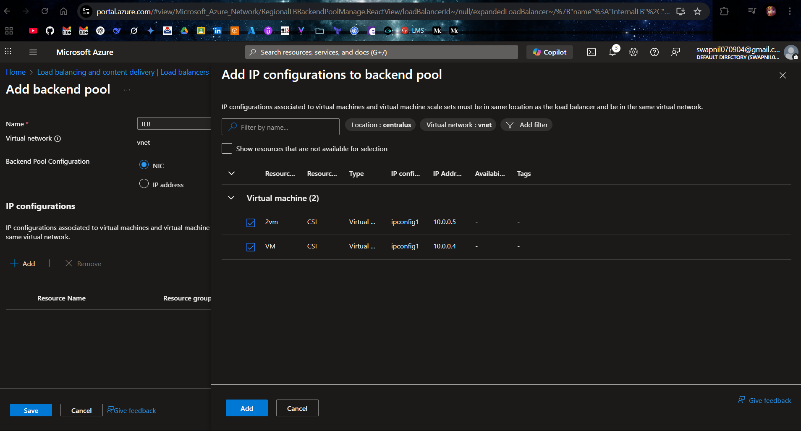

5. **Health Probe**:
   - Protocol: **HTTP**
   - Port: **80**
   - Path: `/`
6. **Load Balancing Rule**:
   - Name: `http-rule`
   - Protocol: TCP
   - Port: 80
   - Health probe: `httpProbe`

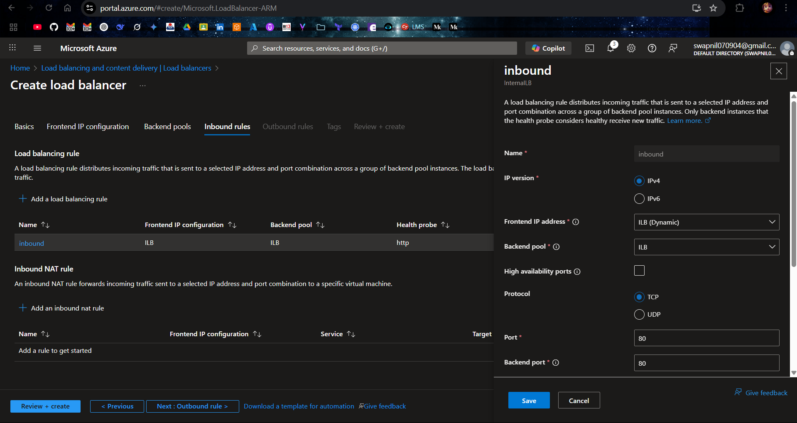

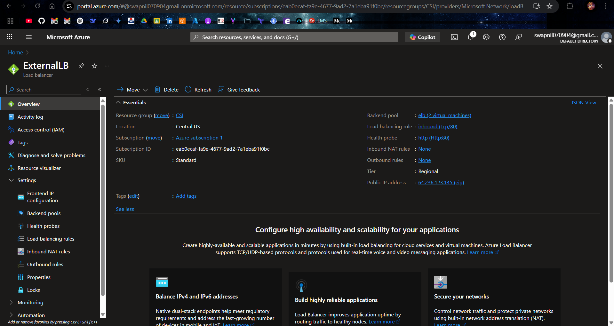

## 🛡️ Part 2: Internal Load Balancer (ILB)

### 2️⃣ Create Internal Load Balancer

1. Go to **Load Balancers** → **+ Create**
2. **Basics**:
   - Name: `internal-lb`
   - Type: **Internal**
   - SKU: Standard or Basic
   - VNet/Subnet: Same as VM subnet

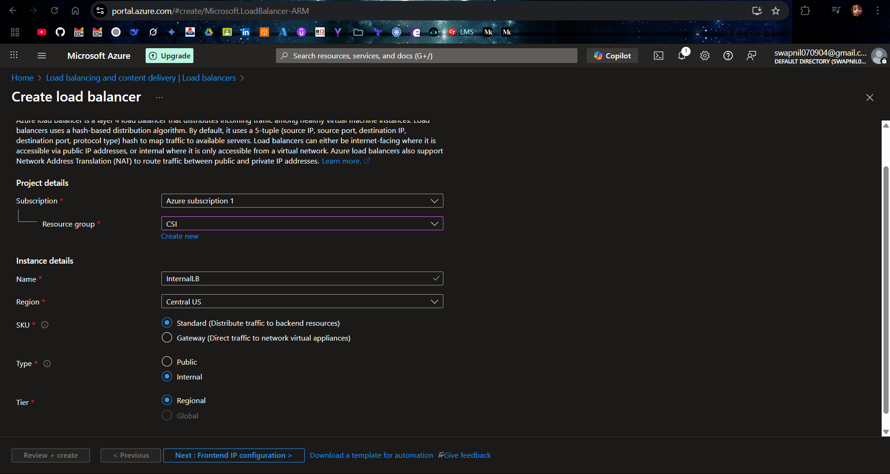

3. **Frontend IP**:
   - Assign static **private IP** from the subnet
4. **Backend Pool**:
   - Same VMs
5. **Health Probe**:
   - Protocol: **HTTP**
   - Port: **80**
   - Path: `/`
6. **Load Balancing Rule**:
   - Protocol: TCP
   - Port: 80

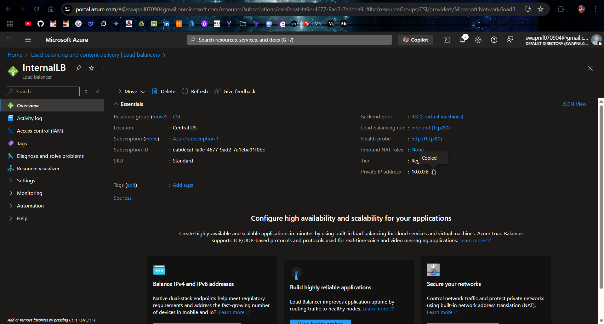

## 🧪 Part 3: Apache2 Setup on VMs

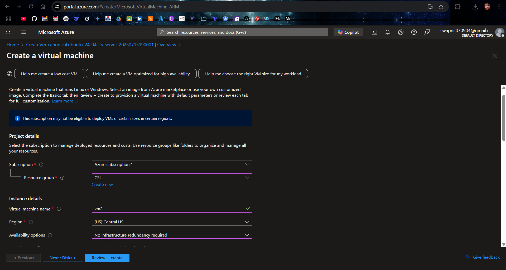

On both VMs:

```bash
sudo apt update
sudo apt install apache2 -y
echo "VM1" | sudo tee /var/www/html/index.html
```

## ✅ Part 4: Verification

### 🔹 External Load Balancer

- Open browser:
  ```
  http://<Public-IP-of-ExternalLB>
  ```
- Refresh multiple times to see hostname alternate.

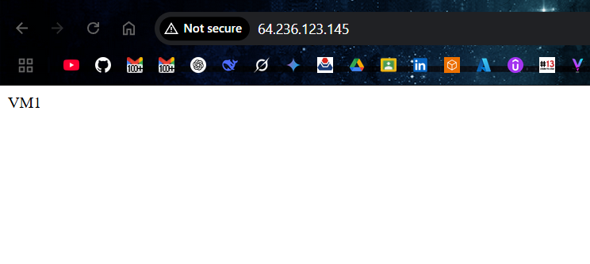

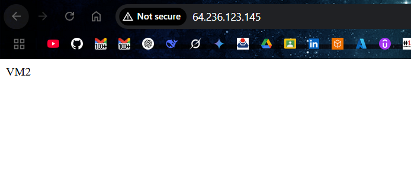

### 🔸 Internal Load Balancer

- From another VM in the same VNet:
  ```bash
  curl http://<Private-IP-of-InternalLB>
  ```
- You should receive alternating VM hostnames.

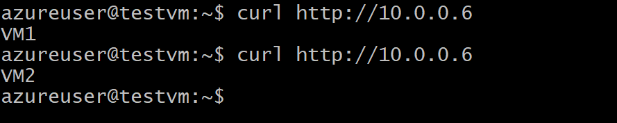