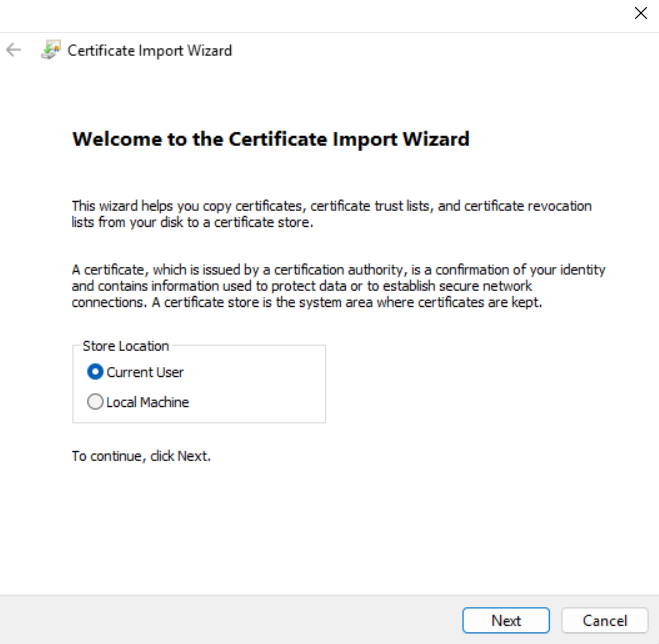

# 🌐 Azure Point-to-Site (P2S) VPN Setup & Verification

This document explains how to configure a **Point-to-Site connection** on Azure.


## **🛠 Steps to Set Up Point-to-Site VPN**


## **1. Create a Virtual Network (VNet)**

1. Go to **Azure Portal** → `Create a resource`.
2. Search for **Virtual Network**.
3. Configure:
   - **Address Space**: e.g., `10.1.0.0/16`.
   - **Subnet Purpose**: `Virtual Network Gateway`.
   - **Subnet**: Create a subnet, e.g., `10.1.1.0/24`.
4. Click **Review + Create**.


## **2. Create a Virtual Network Gateway**

1. Go to **Azure Portal** → `Create a resource`.
2. Search for **Virtual Network Gateway**.
3. Configure:
   - **Gateway Type**: `VPN`.
   - **VPN Type**: `Route-based`.
   - **SKU**: `VpnGw1`.
   - **Virtual Network**: Select the VNet created in step 1.
   - **Public IP Address**: Create a new public IP.
4. Wait for the gateway to deploy (may take 30–45 minutes).


## **4. Generate Certificates**

Azure requires a root certificate and a client certificate for VPN authentication.

### **4.1 Create Root Certificate**
Run the following PowerShell command:
```powershell
New-SelfSignedCertificate -Type Custom -KeySpec Signature `
-Subject "CN=AzureP2SRootCert" -KeyExportPolicy Exportable `
-HashAlgorithm sha256 -KeyLength 2048 `
-CertStoreLocation "Cert:\\CurrentUser\\My" -KeyUsageProperty Sign -KeyUsage CertSign
```

Export the root certificate (Base-64 `.cer`) using Certificate Manager:
- Open **certmgr.msc** → **Personal → Certificates**.
- Find `AzureP2SRootCert`.
- Export as **Base-64 encoded X.509 (.CER)** file.
- Open .cer file in Notepad and copy its content.


### **4.2 Create Client Certificate**
Run:
```powershell
$rootCert = Get-ChildItem -Path "Cert:\\CurrentUser\\My" | Where-Object { $_.Subject -like "*AzureP2SRootCert*" }

New-SelfSignedCertificate -Type Custom -DnsName AzureP2SClientCert -KeySpec Signature `
-Subject "CN=AzureP2SClientCert" -KeyExportPolicy Exportable `
-HashAlgorithm sha256 -KeyLength 2048 `
-CertStoreLocation "Cert:\\CurrentUser\\My" -Signer $rootCert
```

Export the client certificate as `.pfx`:
```powershell
Export-PfxCertificate -Cert (Get-ChildItem -Path "Cert:\\CurrentUser\\My" | Where-Object { $_.Subject -like "*AzureP2SClientCert*" }) `
-FilePath "C:\\AzureP2SClientCert.pfx" -Password (ConvertTo-SecureString -String "YourPassword123" -Force -AsPlainText)
```
- Import the client certificate (`.pfx`) by double-clicking and entering the password set earlier.




## **5. Configure Point-to-Site Settings**

1. Navigate to your **Virtual Network Gateway** → `Point-to-site configuration`.
2. Click **Configure Now**.
3. Set:
   - **Address Pool**: e.g., `172.16.0.0/24`.
   - **Tunnel Type**: `IKEv2 and OpenVPN (SSL)`.
4. Set:
   - **Nmae**: `rootcert`.
   - **Public Certificate data**: copied from step 3 (don't put ---BEGIN CERTIFICATE & END CERTIFICATE---). 
5. Save.


## **6. Download and Configure VPN Client**

1. In your **Virtual Network Gateway**, go to `Point-to-site configuration`.
2. Click **Download VPN Client**.
3. Extract the downloaded package.
4. Install the VPN client configuration by running the installer.


## **7. Connect to VPN**

1. Open **Windows VPN Settings**.
2. Click **Connect**.


## **8. Verify VPN Connection**

### **8.1 Check VPN Status**
- Open **Windows VPN settings** and confirm **Connected**.


### **8.2 Verify P2S Connection**
Run:
```cmd
ipconfig
```
- Look for a `PPP adapter` with an IP from the P2S address pool (e.g., `172.16.0.x`).

