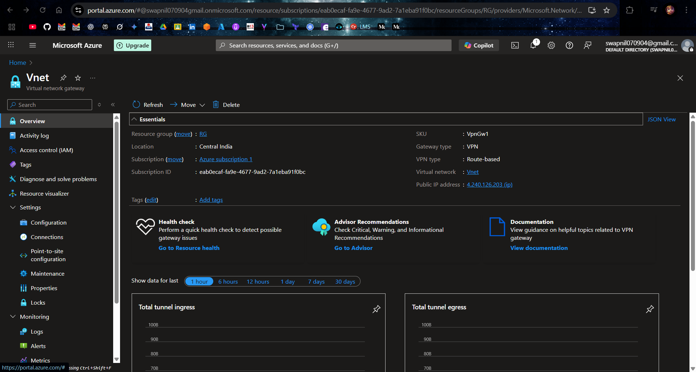

# 🌐 Site-to-Site Connection setup

This document explains how to set up a **Site-to-Site (S2S) VPN** between Azure and an on-premises environment simulated with a Windows Server VM configured as a VPN device using **RRAS (Routing and Remote Access Service)**.  

## Prerequisites
- An **Azure subscription**.
- A **VNet** (e.g., `10.0.0.0/16`) with at least one **GatewaySubnet**.
- A **VPN Gateway** created in the Azure VNet.
- A **Windows Server 2019/2022 VM** with **2 NICs**:
  - **External NIC**: Connected to a public-facing subnet (e.g., `10.0.1.0/24`).
  - **Internal NIC**: Connected to an internal subnet (e.g., `10.0.2.0/24`).
- **Static Public IP** for the on-prem VM (or your real ISP public IP).

## **⚙️ Step-by-Step Configuration**

## **1. Create a Virtual Network (VNet)**

1. Go to **Azure Portal** → `Create a resource`.
2. Search for **Virtual Network**.
3. Configure:
   - **Address Space**: e.g., `10.0.0.0/16`.
   - **Subnet Purpose**: `Virtual Network Gateway`.
   - **Subnet**: Create a subnet.
4. Click **Review + Create**.

## **2. Create a Virtual Network Gateway**

1. Go to **Azure Portal** → `Create a resource`.
2. Search for **Virtual Network Gateway**.
3. Configure:
   - **Gateway Type**: `VPN`.
   - **VPN Type**: `Route-based`.
   - **SKU**: `VpnGw1`.
   - **Virtual Network**: Select the VNet created in step 1.
   - **Public IP Address**: Create a new public IP.
4. Wait for the gateway to deploy.

### **3. Create Local Network Gateway**
1. Go to **Azure Portal → Local Network Gateway**.
2. Set:
   - **Name**: `LNG`
   - **IP Address**: Public IP of your on-prem server.
   - **Address Space**: Internal network range of on-prem VM (e.g., `10.10.2.0/24`).
3. Save.

### **4. Create Site-to-Site Connection**
1. Go to the VPN Gateway → **Connections** → **+ Add**.
2. Choose:
   - **Connection Type**: Site-to-Site (IPsec).
   - **Local Network Gateway**: `LNG`.
   - **Shared Key**: (e.g., `Secret123`).
3. Create the connection.

### **5. Configure On-Prem Windows Server VM**
#### **5.1 Setup Network Interfaces**
1. Verify you have **2 NICs**:
   - **NIC1 (External)**
   - **NIC2 (Internal)**

2. Assign **Static IPs**:
   - For Internal: `192.168.0.1` with mask `255.255.255.0`.

#### **5.2 Install RRAS Role**
1. Open **Server Manager → Add Roles & Features**.
2. Select **Remote Access** → **Role Services** → **Routing**.
3. Complete installation.

### **6. Configure RRAS (Routing & Remote Access Service)**

1. Open **Routing and Remote Access** from Server Manager.
2. Right-click the server → **Configure and Enable Routing and Remote Access**.
3. Select **Custom configuration** → **VPN Access and NAT** → Finish.
4. Start the RRAS service.

### **7. Add Static Routes**
1. In the **New Demand-Dial Wizard**, add static routes:
   - **Destination**: `10.0.0.0` (Azure VNet range).
   - **Mask**: `255.255.0.0`.
   - **Metric**: `1`.
2. After the wizard completes, go to **IPv4 → Static Routes** in the RRAS console.
3. Add any additional required routes.

### **8. Configure Demand-Dial VPN Connection**
1. In **RRAS console**, right-click **Network Interfaces → New Demand-Dial Interface**.
2. Name: `Remote Router`.
3. Select **VPN** → **IKEv2**.
4. Enter **Azure VPN Gateway Public IP** as destination.
5. Enter the **shared key** you set in Azure connection.

### **9. Connect VPN**
1. Right-click the demand-dial interface (`Remote Router`) → **Connect**.
2. Enter any required credentials.

### **10. Verify Connection**
1. In RRAS, check the **Demand-Dial Interface** → **Connected**.

2. In **Azure Portal → Connections**, status should show **Connected**.

